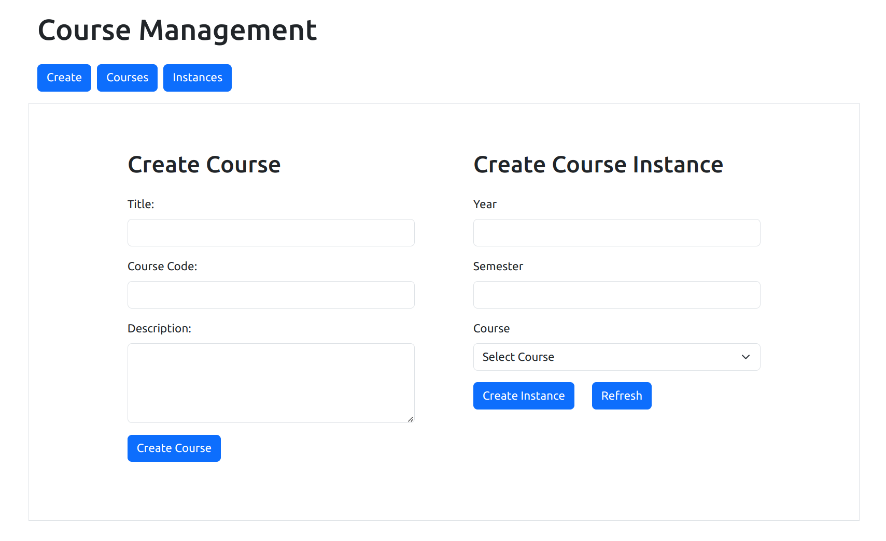
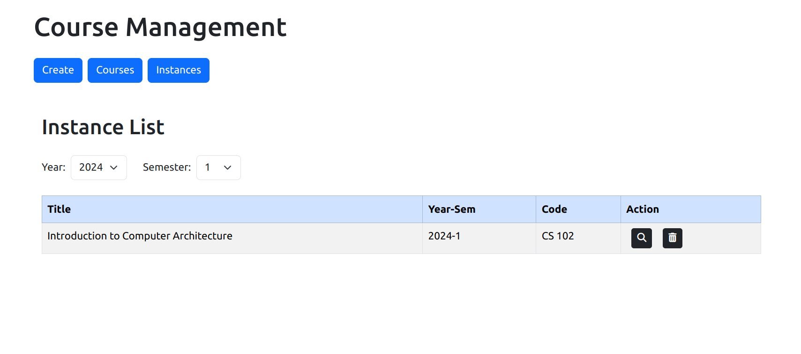

# Course Management Frontend
Frontend for course management application - React, Bootstrap


## Installation
1. Clone the repo ```git clone https://github.com/r0ckYr/course-management-frontend.git```
2. ```cd course-management-frontend```
3. ```npm install```
4. ```npm start```


## Pages

1. Create



2. Courses


3. Instances


