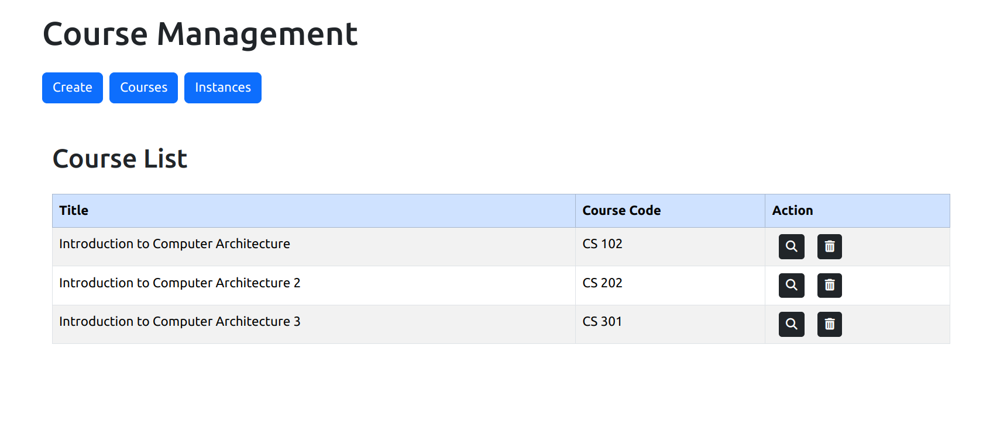

# Course Management Frontend
Frontend for course management application - React, Bootstrap


## Installation
1. Clone the repo ```git clone https://github.com/r0ckYr/course-management-frontend.git```
2. ```cd course-management-frontend```
3. ```npm install```
4. ```npm start```


## Docker
1. ```docker pull r0ckyr/course-management-frontend```
2. ```docker run -p 3000:80 r0ckyr/course-management-frontend```

This will start the application on port 3000

## Pages

1. Create


2. Courses



3. Instances


